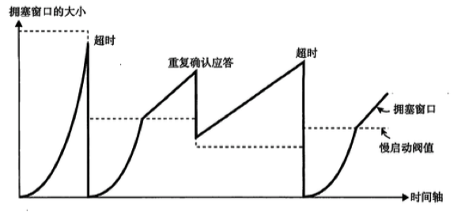

[TOC]

# TCP与UDP

位于传输层

TCP是面向连接的（只有在确认通信对端存在时才会发送数据），可靠的流协议，流就是指不间断的数据结构，你可以把它想象成排水管道中的水流。当应用程序采用TCP发送消息时，虽然可以保证发送的顺序，但还是犹如没有任何间隔的数据流发送给接收端。 TCP为提供可靠性传输，实行“顺序控制”或“重发控制”机制。此外还具有“流量控制”，“拥塞控制”提高网络利用率等众多功能。TCP用于在传输层有必要实现可靠传输的情况。

UDP是不具有可靠性的数据报协议。细微的处理它会交给上层的应用去完成。在UDP的情况下，虽然可以确保发送消息的大小，却不能保证消息一定会到达。UDP主要用于那些对高速传输和实时性有较高要求的通信和广播通信。UDP不提供复杂的控制机制，利用IP提供面向无连接的通信服务。并且它是将应用程序发来的数据在收到的那一刻，立即按照原样发送到网上的一种机制。1.即使是出现网络拥堵的情况下，UDP也无法进行流量控制等避免网络拥堵的行为。2.此外在传输途中即使出现丢包，UDP也不负责重发，甚至当出现包的到达顺序乱掉时也没有纠正的功能。如果需要这些细节控制，那么不得不交由采用UDP的应用程序去处理（比如QQ采用UDP实现传输，UDP本身不具有流量控制和是重发机制能功能，如果非要实现就要QQ去做特殊处理了）。UDP面向无连接，可以随时发送数据，再加上UDP本身的处理既简单有高效，所以常用下面几个方面：包总量较少的通信（DNS,SNMP等），视频音频等多媒体处理（即时通信），广播通信（广播，多播）。

# TCP三次握手

第一次握手：建立连接时，客户端发送syn包(syn=j)到服务器，并进入SYN_SEND状态，等待服务器确认；

第二次握手：服务器收到syn包，必须确认客户的SYN（ack=j+1），同时自己也发送一个SYN包（syn=k），即SYN+ACK包，此时服务器 进入SYN_RECV状态；

第三次握手：客户端收到服务器的SYN＋ACK包，向服务器发送确认包ACK(ack=k+1)，此包发送完毕，客户端和服务器进入 ESTABLISHED状态，完成三次握手。

# TCP四次握手

第一次握手：断开连接端可以是Client端，也可以是Server端。假设Client端发起中断连接请求，就先发送FIN报文。

第二次握手：Server端接到FIN报文后，但是如果还有数据没有发送完成，则不必急着关闭Socket，可以继续发送数据。所以服务器端先发送ACK，告诉Client端：请求已经收到了，但是我还没准备好，请继续等待停止的消息。这个时候Client端就进入FIN_WAIT状态，继续等待Server端的FIN报文。

第三次握手：当Server端确定数据已发送完成，则向Client端发送FIN报文，告诉Client端：服务器这边数据发完了，准备好关闭连接了。

第四次握手：Client端收到FIN报文后，就知道可以关闭连接了，但是他还是不相信网络，所以发送ACK后进入TIME_WAIT状态， Server端收到ACK后，就知道可以断开连接了。Client端等待了2MSL后依然没有收到回复，则证明Server端已正常关闭，最后，Client端也可以关闭连接了至此，TCP连接就已经完全关闭了！

# 为什么建立连接时是三次握手，两次行不行？

在英雄儿女的电影中，友军双方黄河和长江利用发报机通话。

第一次握手：黄河发起呼叫，长江收到了。这时长江可以确认的是，黄河的发信机和自己的收信机都是好的，否则的话他收不到黄河的呼叫，黄河能确认什么呢？他什么也不能确认，有可能自己的电台除了指示灯是好的，其他都是坏的，他在对着一台铁疙瘩发功。

第二次握手：长江回应，黄河收到了。这时黄河可以确认的是，自己和长江的收发信机都是好的，否则的话他收不到长江的回应信号。这时黄河可以说正事了么？还不能，虽然长江发出了回应，但他并不能确认自己的发信机和黄河的发信机都是好的。

第三次握手：黄河对长江的回应进行回应。这时黄河很清楚双方收发信机都是好的，自己的这次回应长江肯定能收到，这个回应的目的只是消除长江对黄河的收信机和长江的发信机的担心，因为有可能长江发送了回应，但是黄河没有收到。然后，黄河不必等长江再次回应就可以说正事了。

# 如果建立链接的第三次握手失败了怎么处理？关闭连接时，第四次握手失败怎么处理？

第三次握手其实解决了第二步的数据包丢失问题。那么第三步的ACK确认丢失后，TCP协议是如何处理的呢？按照TCP协议处理丢包的一般方法，服务器会重新向客户端发送数据包，直至收到ACK确认为止。但实际上这种做法有可能遭到SYN泛洪攻击。所谓的泛洪攻击，是指发送方伪造多个IP地址，模拟三次握手肚饿过程。当服务器返回ACK后，攻击方故意不确认，从而使得服务器不断重发ACK。由于服务器长时间处于半连接状态，最后消耗过多的CPU和内存资源导致死机。

正确的处理办法是服务器发送RST报文，进入CLOSE状态。这个RST数据包的TCP首部中，控制位中的RST位被设置为1.这表示链接信息全部被初始化，原有的TCP用心不能继续进行。客户端如果还想重新建立TCP链接，就必须重新开始第一次握手。

在关闭链接时，最后一个ACK丢失，实际上在第三步中，客户端收到FIN包时，它会设置一个计时器，等待相当长的一段时间，如果客户端返回的ACK丢失，那么服务器还会重发FIN并充值计时器。假设在计时器失效前服务器重发的FIN包没有到达客户端，客户端就会进入CLOSE状态，从而导致服务端永远无法收到ACK确认，也就无法关闭链接。

# TCP协议是如何进行流量控制，拥塞控制的？

### 流量控制：（窗口大小）

发送端根据自己的实际情况发送数据。但是，接收端可能受到的是一个毫无关系的数据包又可能会在处理其他问题上花费一些时间，因此在为这个数据包做其他处理时会耗费一些时间。甚至在高负荷的情况下无法接受任何数据。如果一来，如果接收端将本应该接收的数据丢弃的话，就会触发重发机制，从而导致网络流量的无端浪费。

为了防止这种现象的发生，TCP提供一种机制可以让发送端根据接收端的实际接收能力控制发送的数据量。这就是所谓的流量控制。它的具体操作是，接收端主机向发送端主机通知自己可以接收数据的大小。窗口大小的值就是由接收端主机决定的。

TCP首部中，专门有一个字段用来通知窗口的大小。接收主机将自己可以接收的缓冲区大小放入这个字段中通知给发送端。这个字段的值越大，说明网路偶的吞吐量越高。

不过，接收端的这个缓冲区一旦面临数据溢出时，窗口大小的值也会随之被设置为一个更小的值通知给发送端，从而控制数据发送量。也就是说，发送端主机会根据接收端主机的提示，对发送数据的量进行控制。这也行程了一个完整的TCP流控制（流量控制）

<u>如果这个窗口的更新通知在传送途中丢失，可能会导致无法继续通信，为避免此类问题发生，发送端主机会时不时发送一个叫做窗口探测的数据段，此数据段仅为一个字节以获取最新的窗口大小信息。</u>

### 拥塞控制：（拥塞窗口）

一般来说，计算机网络都处在一个共享的环境，因此也有可能会因为其他主机之间的通信使得网络拥堵。在网络出现拥堵时，如果突然发送与一个较大量的数据，极有可能会导致整个网络的瘫痪。

TCP为了防止该问题的出现，在通信一开始就会通过一个叫做***\*慢启动的算法\****得出的数值，对发送数据量进行控制。

首先，为了在发送端调节索要发送数据的量，定义了一个叫做“拥塞窗口”的概念。于是在慢启动的时候，将这个拥塞窗口的大小设置为1个数据段(1MSS)发送数据，之后每收到一次确认应答（ACK），拥塞窗口的值就加1.在发送数据包时，将拥塞窗口的大小与接收端主机通知的窗口大小做比较，然后按照他们当中较小那个值，发送比其还要小的数据量。

如果重发采用超时机制，那么拥塞窗口的初始值可以设置为1以后再进行慢启动修正。有了上述这些机制，就可以有效地减少通信开始时连续发包导致的网络拥堵，还可以避免网络拥塞情况的发生。

不过随着包的每次往返，拥塞窗口也会以1，2，4等指数函数的增长，拥堵情况激增甚至导致网络拥塞的发生。为了防止这些，引入了慢启动阈值的概念。只要拥塞窗口的值超出这个阈值，在每收到一次确认应答时，只允许以下面这种比例方法拥塞窗口：

拥塞窗口越大，确认应答的数目也会增加。不过随着每收到一个确认应答，其涨幅也会逐渐减少，甚至效果比一个数据段还要小的字节数。因此，拥塞窗口的大小会呈直线上升的趋势。

TCP的通信开始时，并没有设置相应的慢启动阈值。而是在超时重发时，才会设置为当时拥塞窗口一般的大小。

由重发确认应答而触发的高速重发与超时重发机制的处理多少有些不同。因为前者要求至少3次的确认应答数据段到达对方主机后才会触发，相比后者网络的拥堵要轻一些。

而由重复确认应答进行高速重发控制时，慢启动阈值的大小被设置为当时窗口大小的一半。然后将窗口的大小设置为该慢启动阈值+3个数据段的大小。

有了这样一种控制，TCP的拥塞窗口如上图所示发生变化。由于窗口的大小会直接影响数据被转发的吞吐量，所以一般情况下，窗口越大，越会形成高吞吐量的通信。

当TCP通信开售以后，网络吞吐量会逐渐上升，但是随着网络拥堵的发生吞吐量也会急速下降。于是会再次进入吞吐量慢慢上升的过程。因此所谓TCP的吞吐量的特点就好像是在逐步占领网络宽带的感觉。
